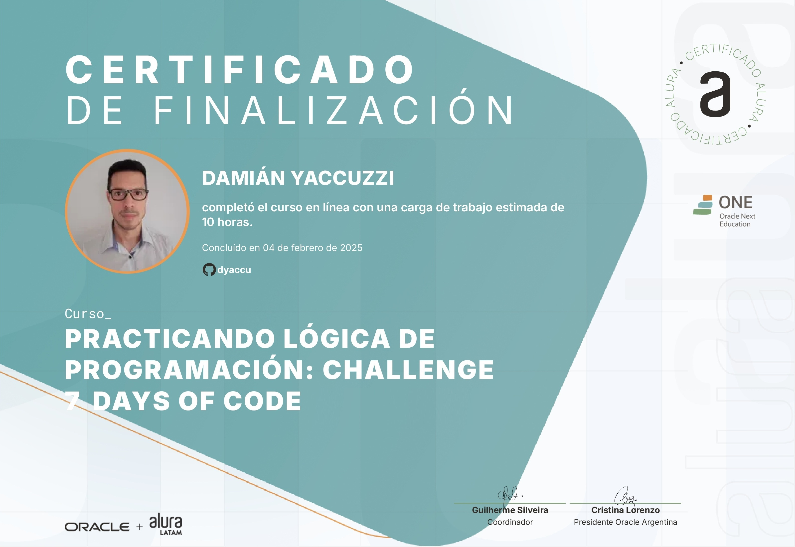

# 7DaysOfCode - Creación del Certificado

Este repositorio contiene el código fuente de la creación del certificado del challenge **7DaysOfCode**. 

## 📜 Descripción

Este proyecto consiste en la creación de un certificado en **HTML y CSS**, basado en los requerimientos del challenge **7DaysOfCode**. La estructura del documento y el diseño han sido implementados de manera responsiva para asegurar una correcta visualización en diferentes dispositivos.

## 🚀 Tecnologías utilizadas

- **HTML5** para la estructura del certificado.
- **CSS3** para el diseño y la presentación.

## 📂 Estructura del Proyecto

```
/7DaysOfCode-Certificado
│── index.html  # Estructura del certificado
│── styles.css  # Diseño y estilos
│── assets/     # Carpeta de imágenes y recursos adicionales
│── README.md   # Documentación del proyecto
```

## 📸 Vista previa




## 🛠 Uso & Interacciones

1. Visitar este repositorio:
   ```
   https://github.com/dyaccu/a8ff96b0-5f45-44e3-a26b-5e618554c141
   ```
2. Ver el frente el Certificado
3. Interactuar con la página haciendo clic en la flecha ---> para ver el dorso del Certificado
4. Ver el Certificado formal.

## 📄 Licencia

Este proyecto es de uso libre. Puedes modificarlo y adaptarlo según tus necesidades. No es un certificado OFICIAL.
